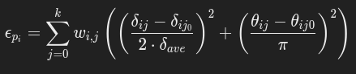

# GUIDE THROUGH

In the current directory, it's possible to find an unofficial implementation of a Non Linear Dimensionality Reduction Algorithm, Manifold Sculpting, developed by M. Gashler, D. Ventura and T. Martinez. [paper](https://proceedings.neurips.cc/paper/2007/file/c06d06da9666a219db15cf575aff2824-Paper.pdf).

Python libraries have been used to perform the analysis, and they are the following: numpy, scikit-learn, matplotlib, pandas. 

## The method

Manifold Sculpting is a Non Linear Dimensionality Reduction method used to perform the projection from a space of higher dimension to one of lower dimension of a non-linear data distributions, preserving the essential structure of the manifold. 

It operates iteratively, simulating surface tension to smooth and flatten the data, making it more compact then other algorithms, letting us avoid loosing significant information. 

The algorithm has 5 steps:

1. Find the k nearest neighbors of each point. 
2. Compute a set of relationships through the neighbors. The relationships are computing through euclidean distance between point $p_{i}$ and each neighbors $n_{ij}$.
3. (Optional steps, but highly recommended) Perform PCA, to get faster convergence. 
4. The algorithm is divided in two steps:
    
   - **SCALING VALUES:** All the values in the dimensions that will be scaled, denoted by $D_{scaled}$, are scaled by a constant factor $\sigma$, a value $0 < \sigma < 1$. Overtime, $D_{scaled}$ will converge to $0$. The dimensions that are converging to $0$ will be discarded, as they provide redundant information. 
   - **RESTORING THE ORIGINAL VALUES:** For each data point $p_{i}$, the values of the preserved dimensions, denoted by $D_{preserved}$ are adjusted to recover the relationships by the scaling. Intuitevely, this step simulates tension on the manifold surface. An heuristic error value is used to evaluate the current relationships among data points relative to the original ones:

    

      
    

  
   where:
   - $\delta_{ij}$ is the current distance of $p_{i}$ from the point $n_{ij}$, 
   - $\delta_{ij0}$ is the original distance of $p_{i}$ to $n_{ij}$ measured at step 2, 
   - $\theta_{ij}$ is the current angle, 
   - $\theta_{oij0}$ is the original angle measured at step 2.

   The denominators are chosen as normalizing factors, as the value of angle term can range between $0$ and $\pi$, and the value of the distance will have a mean of about $\delta_{ave}$.

5. We project the data. $D_{scaled}$ contains now only values that are close to zero. The data points are projected by simply dropping the redundant dimensions $D_{scaled}$. This reduces the overall dimensionality. Discarding $D_{scaled}$ we won't have significant loss of information.

## Conclusions

After running the tests on an S-Curve manifold and a Swiss Roll manifold, Manifold Sculpting performs well at the increasing number of neighbors, keeping the error steadily stable. Isomap results to be the algorithm that perfoms worse overall. 
HHLE performs greatly as well, but it's computationally costly. 

